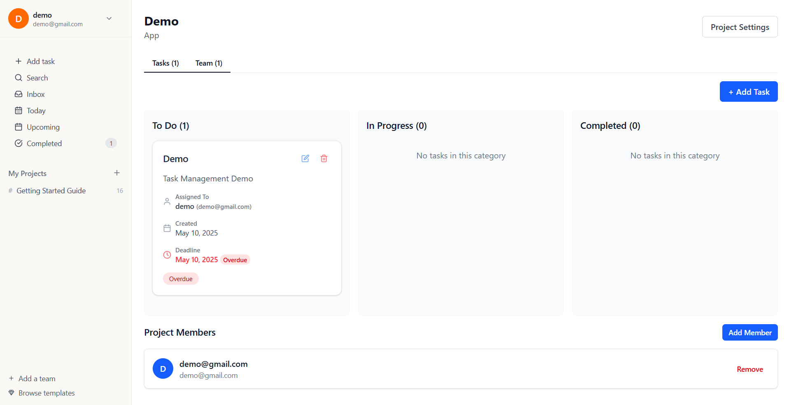
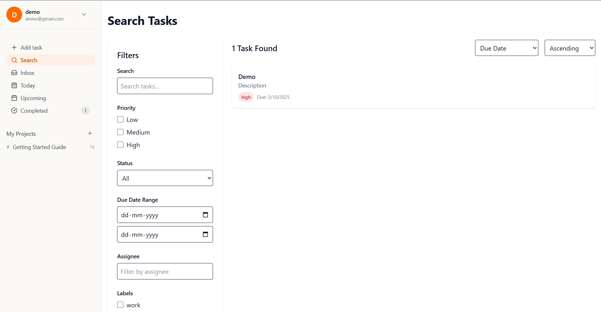

# Task Management System

A web-based application for small teams to manage tasks efficiently — create, assign, track, and collaborate on tasks with ease.

## 🚀 Live Demo

🔗 [Live App](https://task-mangement-website.vercel.app/)


## 🔑 Features

- **User Authentication** (Register/Login, hashed passwords)
- **Task Management** (Create, Update, Delete, Assign)
- **Team Collaboration** (Assign tasks to other users, in-app notifications)
- **Dashboard Overview** (Tasks created, assigned, overdue)
- **Search & Filter** (By title, status, priority, due date)

## 🛠️ Tech Stack

- **Frontend:** Next.js
- **Backend:** Node.js with Express or NestJS
- **Database:** MongoDB or PostgreSQL
- **Deployment:** Vercel / Render / Railway
- **Auth:** JWT / Sessions
- **Version Control:** Git + GitHub

- ## 📸 Screenshots

  




## 📦 Getting Started

### 1. Clone the Repo

```bash
git clone https://github.com/yourusername/task-manager.git
cd task-manager
````

### 2. Backend Setup

```bash
cd backend
npm install
```

Create `.env` file:

```
PORT=5000
DB_URI=your_database_uri
JWT_SECRET=your_secret_key
```

Run backend:

```bash
npm run start
```

### 3. Frontend Setup

```bash
cd frontend
npm install
```

Create `.env.local` file:

```
NEXT_PUBLIC_API_URL=http://localhost:5000
```

Run frontend:

```bash
npm run dev
```

## 📌 Assumptions

* One user per task assignment
* Notifications are in-app only
* Only registered users can interact with tasks

## 📄 Documentation

* Includes setup instructions, environment configs, and deployment steps
* All endpoints follow REST conventions

## 🧪 Testing

* Basic testing with Postman
* Optional: Jest unit tests for critical logic

## 👤 Author

**Your Name**
📧 [your.email@example.com](mailto:your.email@example.com)
🔗 [LinkedIn](https://linkedin.com/in/yourname)
🐙 [GitHub](https://github.com/yourusername)

## 📃 License

MIT License

```

---

Let me know if you'd like help replacing any of the placeholders or formatting screenshots!
```
