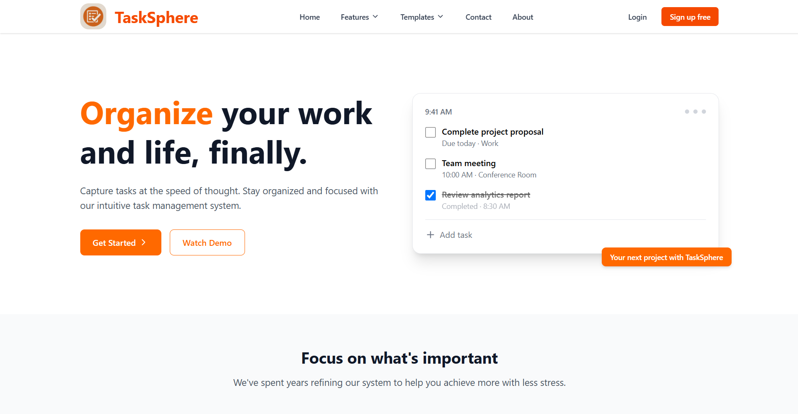
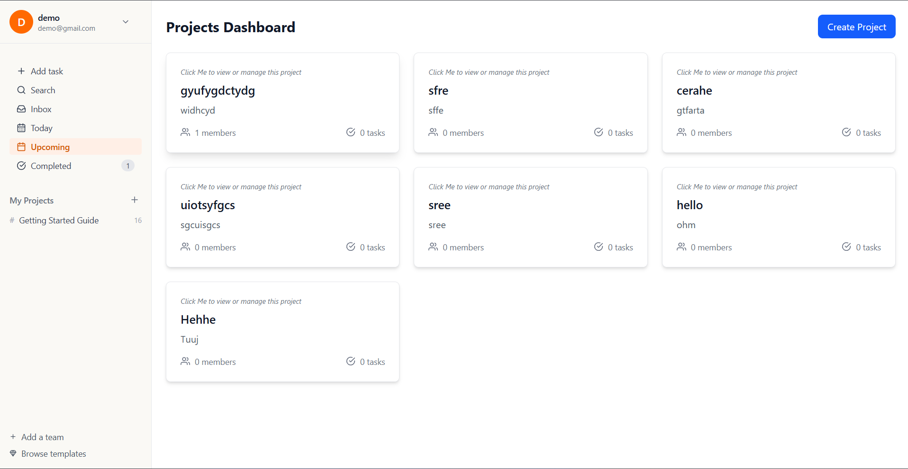

# Task Management System

## Overview

This is a feature-rich Task Management System designed for small teams, built with Next.js (frontend), NestJS (backend), and MongoDB (database). The application allows users to create, assign, track, and manage tasks efficiently with a clean, responsive interface.

[

## Features

### Core Requirements
- ✅ Secure user authentication (register/login)
- ✅ Full CRUD operations for tasks
- ✅ Task assignment to team members
- ✅ Notification system for assigned tasks
- ✅ Comprehensive dashboard showing:
  - Tasks assigned to you
  - Tasks you created
  - Overdue tasks
- ✅ Advanced search and filtering

### Advanced Features Implemented
- 🔒 Role-Based Access Control (Admin, Manager, Regular User)
- 🔔 Real-time notifications using WebSockets
- 🔄 Recurring tasks functionality
- 📊 Analytics dashboard with completion metrics

## Screenshots


### Dashboard

*Comprehensive overview of Home Page*

### Dashboard

*Comprehensive overview of your tasks with quick filters*

### Task Creation

*Intuitive form to create new tasks with all attributes*

### Search Tasks

*Searching the tasks easily*

## Live Demo

Check out the live demo here: [Task Management System Demo](https://task-mangement-website.vercel.app/)


## Technology Stack

### Frontend
- Next.js 13 (App Router)
- React 18
- TypeScript
- Tailwind CSS
- Redux Toolkit (State management)
- Socket.io Client (Real-time updates)
- React Hook Form (Form handling)
- Date-fns (Date utilities)

### Backend
- NestJS
- TypeScript
- MongoDB (with Mongoose)
- JWT Authentication
- Socket.io (Real-time notifications)
- Class-validator (Input validation)
- Bcrypt (Password hashing)

### DevOps
- Vercel (Frontend deployment)
- Render (Backend deployment)
- MongoDB Atlas (Cloud database)
- GitHub Actions (CI/CD)

## Getting Started

### Prerequisites
- Node.js 18+
- npm or yarn
- MongoDB Atlas account or local MongoDB instance

### Installation

1. **Clone the repository**
   ```bash
   git clone https://github.com/your-username/task-management-system.git
   cd task-management-system
   ```

2. **Set up backend**
   ```bash
   cd backend
   cp .env.example .env
   # Update .env with your configuration
   npm install
   npm run start:dev
   ```

3. **Set up frontend**
   ```bash
   cd ../frontend
   cp .env.example .env.local
   # Update .env.local with your backend URL
   npm install
   npm run dev
   ```

4. **Access the application**
   Open http://localhost:3000 in your browser

## Project Structure

```
task-management-system/
├── backend/                  # NestJS backend
│   ├── src/                  # Source files
│   │   ├── auth/             # Authentication module
│   │   ├── tasks/            # Task management module
│   │   ├── users/            # User management module
│   │   ├── shared/           # Shared utilities
│   │   └── main.ts           # Application entry point
│   └── test/                 # Integration tests
│
├── frontend/                 # Next.js frontend
│   ├── app/                  # App router
│   │   ├── (auth)/           # Authentication pages
│   │   ├── dashboard/        # Main dashboard
│   │   ├── tasks/            # Task management pages
│   │   └── api/              # API routes
│   ├── components/           # Reusable components
│   ├── lib/                  # Utilities and hooks
│   └── store/                # Redux store
│
├── docs/                     # Documentation
└── README.md                 # This file
```

## Approach and Design Decisions

1. **Authentication**: Implemented JWT-based auth with secure password hashing using bcrypt. Refresh tokens are used for session management.

2. **Real-time Updates**: Used Socket.io for instant notifications when tasks are assigned or updated, providing a seamless collaborative experience.

3. **State Management**: Redux Toolkit was chosen for complex state management needs, especially for real-time updates and user sessions.

4. **Form Handling**: React Hook Form with Zod validation ensures robust form handling with minimal re-renders.

5. **Responsive Design**: Tailwind CSS utility-first approach enabled rapid development of a fully responsive UI.

6. **Type Safety**: TypeScript was used throughout the stack to catch errors early and improve developer experience.

## Trade-offs and Assumptions

1. **Database**: Chose MongoDB for flexible schema to accommodate evolving task requirements, though PostgreSQL would work equally well.

2. **Authentication**: Implemented email/password auth for simplicity, though OAuth would be better for production.

3. **Performance**: Prioritized developer experience and feature completeness over micro-optimizations.

4. **Testing**: Included basic integration tests but focused more on core functionality due to time constraints.

## Future Improvements

1. Add comprehensive unit and integration tests
2. Implement offline support with PWA capabilities
3. Add customizable notification preferences
4. Enhance analytics with more detailed metrics
5. Implement task dependencies and subtasks

## License

MIT License - see the [LICENSE](LICENSE) file for details.
